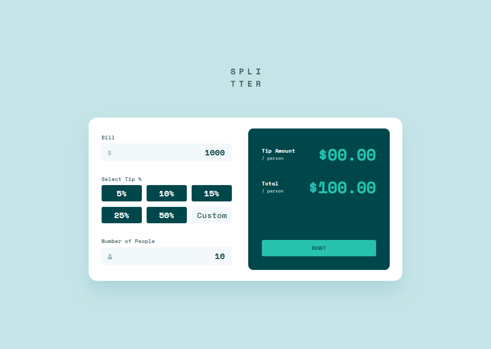
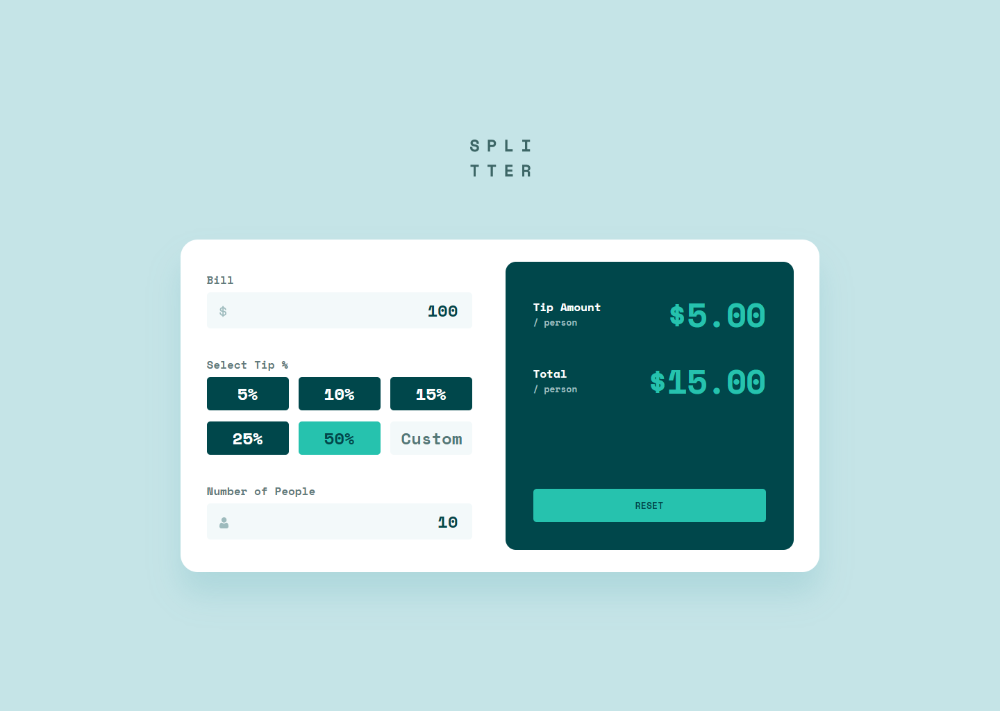
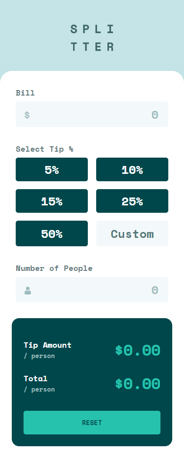
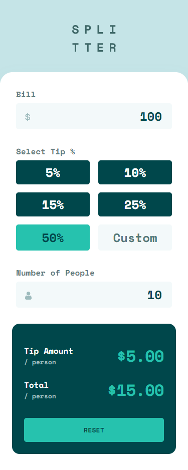

# Frontend Mentor - Tip calculator app solution

This is a solution to the [Tip calculator app challenge on Frontend Mentor](https://www.frontendmentor.io/challenges/tip-calculator-app-ugJNGbJUX). Frontend Mentor challenges help you improve your coding skills by building realistic projects.

## Table of contents

- [Overview](#overview)
  - [The challenge](#the-challenge)
  - [Screenshot](#screenshot)
  - [Links](#links)
- [My process](#my-process)
  - [Built with](#built-with)
  - [What I learned](#what-i-learned)
- [Author](#author)

## Overview

### The challenge

Users should be able to:

- View the optimal layout for the app depending on their device's screen size
- See hover states for all interactive elements on the page
- Calculate the correct tip and total cost of the bill per person

### Screenshot






### Links

- Solution URL: (https://www.frontendmentor.io/solutions/responsive-tip-calculator-with-validation-vanilla-js-fwgPjEchS)
- Live Site URL: (https://lm-tip-calculator.netlify.app/)

## My process

### Built with

- Semantic HTML5 markup
- Vanilla Javascript
- CSS custom properties/vars
- Desktop-first workflow

### What I learned

The markup/styling wasn't so challenging, just took a little bit of time to setup styles, and code it all, but I didn't exactly learn anything new. This was just practice for me.

The learning and main bulk of this project came from the Javascript side. I'm a perfectionist and tried my best with the Javascript, covering all main angles. For example, you can still view the money per person without giving a tip, if you miss out the tip input section. However, you can then add the tip and it will recalculate it all and add in the tip per person too.

This was the most core vanilla Javascript & DOM manipulation I've done in like a year, since I typically use React. One thing I learnt that I would not normally use due to the way React works, is that you can select an element with:

```js
const example = document.getElementById('...');
```

And then use that variable further to select a specified child element within using querySelector:

```js
const childInput = example.querySelector('input');
```

I had knowledge of querySelector, but didn't know you could use it like this, to obtain a child element from a DOM element you've already got stored in a variable!

## Author

- Website - [Leon Michalak](https://www.leonmichalak.tech)
- Frontend Mentor - [@NinjaInShade](https://www.frontendmentor.io/profile/NinjaInShade)
- Instagram - [@lmdeveloper](https://www.instagram.com/lmdeveloper/)
